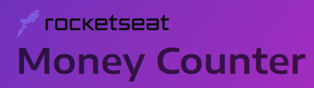
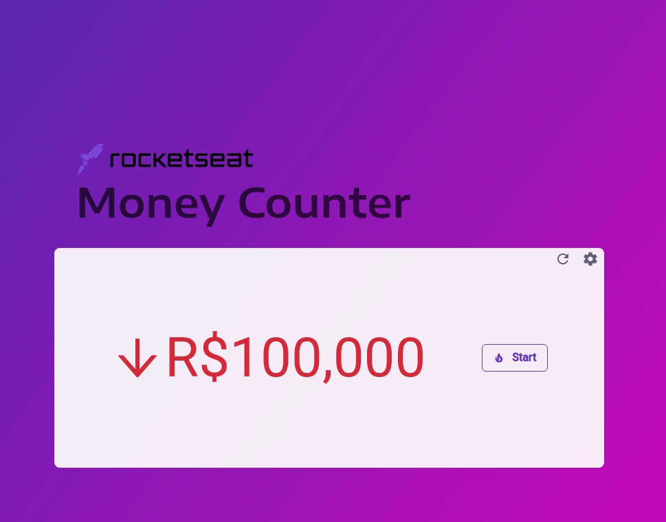

<h1 align="center">
  <br>
  </img>
  <br>
  Money Counter
  <br>
</h1>

<h4 align="center">A copy of money counter application that <a href="https://www.rocketseat.com.br" target="_blank">Rocketseat</a> used in their <a href="https://www.youtube.com/watch?v=A-_IxJIXGNc&t=1449s">reality show</a> called <a href="https://lp.rocketseat.com.br/inscricao/showmethecode">Show me the code</a>.</h4>

<p align="center">
  <a href="https://moneycounter.luanmartins.com">
    
  </a>
  

  <a href="https://moneycounter.luanmartins.com">
    
  </a>
  <a href="https://moneycounter.luanmartins.com">
      
  </a>
  <a href="https://moneycounter.luanmartins.com">
      
  </a>
  <a href="https://moneycounter.luanmartins.com">
    
  </a>  
</p>

<p align="center">
  <a href="https://reactjs.org/" target="_blank"> 
    •
  <a href="https://nodejs.org" target="_blank"> 
   
</a>  •
  <a href="https://chakra-ui.com" target="_blank"> 
   
</a>  •
  <a href="https://www.typescriptlang.org" target="_blank"> 
   
</a> 
</p>

<p align="center">
  <kbd>
    
  </kbd>
  &nbsp;&nbsp;&nbsp;&nbsp;
</p>

## :blush: Why

When I watched the rocketseat reality show I was thinking about projects I could do to keep improving myself in React. So I looked at that simple screen that was used in episode 5. The screen was counting the money decreasing simulating a company with a problem to be solved and I immediately thought that it would be very interesting to be able to recreate that situation. 

So instead of keep playing video games, why not to make a simple but fun React project that other people can use it?

## :paw_prints: Key Features

* Start and Stop - Make it simple
* Reload the money
* Configure How much you'll start before start the challenge  

## :ok_hand: How To Use

:cupid: It's simple, Just go to: [moneycounter.luanmartins.com](https://moneycounter.luanmartins.com) :cupid:

But if you want to download and change something just go to these steps:

To clone and run this application, you'll need [Git](https://git-scm.com) and [Node.js](https://nodejs.org/en/download/) (v \^14.17) (which comes with [npm](http://npmjs.com)) installed on your computer. From your command line:

```bash
# Clone this repository
$ git clone https://github.com/luanrem/smtc-moneycounter
# Go into the repository
$ cd smtc-moneycounter
# Install dependencies
$ yarn
# Run the app
$ yarn start
```
## :octocat: Credits

This software uses the following open source packages:

- [React.JS](https://reactjs.org)
- [Node.js](https://nodejs.org/)
- [Chakra-ui](https://chakra-ui.com)
- [React-Icons](https://react-icons.github.io/react-icons/)
- Emojis are taken from [here](https://gist.github.com/rxaviers/7360908)

## :mortar_board: License

MIT

---

> GitHub [@luanrem](https://github.com/luanrem) &nbsp;&middot;&nbsp;
> Linkedin [@luanrem](https://www.linkedin.com/in/luanrem)